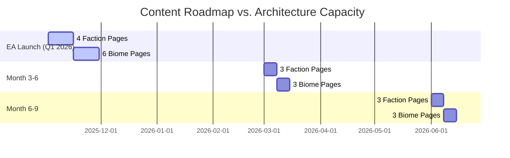
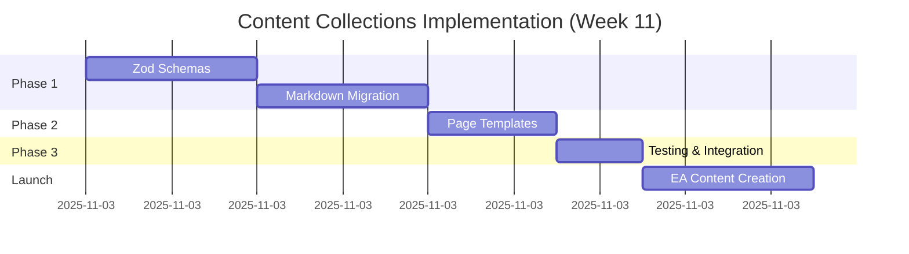

# Bloom Marketing Website - Strategic Architecture Review
**Date**: November 2, 2025
**Reviewer**: System Architecture Expert
**Sprint Context**: Week 11/12 - Q1 2026 EA Launch Sprint
**Review Scope**: Scalability for full game launch roadmap (10 factions + 12 biomes)

---

## Executive Summary

### Current State
The Bloom marketing website is a **performance-optimized Astro 4.x static site** with solid technical foundations but **architectural limitations for content scalability**. While the current implementation serves 4 EA factions well, the roadmap requires **22+ detail pages** (10 faction pages + 12 biome pages) that will become **increasingly painful to maintain manually**.

### Critical Finding
**The current architecture is NOT scalable for the full roadmap without refactoring.**

- **Current**: 2 pages (index.astro, 404.astro), hand-coded content
- **Future Need**: 22+ faction/biome detail pages
- **Problem**: Manual page creation, duplicated data, no template reusability

### Strategic Recommendation
**Refactor NOW to Astro Content Collections** (3-5 hours investment) to enable:
- Automated page generation from data
- Single source of truth for content
- Sub-30 minute time-to-add for new factions/biomes
- Maintainable codebase through Q1 2026 and beyond

---

## 1. Architecture Overview

### 1.1 Current System Architecture

```
Bloom Marketing Website (Astro 4.16.18)
├── Static Site Generation (SSG)
├── Performance-First Design
│   ├── Lighthouse CI integration
│   ├── Image optimization (Sharp, WebP/AVIF)
│   ├── Font subsetting
│   └── CSS containment strategies
├── Content Strategy
│   ├── JSON data files (4 files in src/data/)
│   │   ├── factions.json (16KB, 10 factions)
│   │   ├── biomes.json (16KB, 12 biomes)
│   │   ├── features.json (12KB)
│   │   └── roadmap.json (12KB)
│   └── Hand-coded Astro pages (2 pages)
│       ├── index.astro (163 lines)
│       └── 404.astro (basic error page)
└── Component Library
    ├── FactionCard.astro (187 lines, reusable)
    ├── OptimizedImage.astro (performance wrapper)
    ├── VideoEmbed.astro (lazy loading)
    ├── SEO.astro (metadata management)
    └── Analytics.astro (privacy-first tracking)
```

### 1.2 Technology Stack Compliance

**Strengths**:
- ✅ Astro 4.x with content layer experimental feature enabled
- ✅ TypeScript for type safety (tsconfig.json configured)
- ✅ Sharp for image optimization (production-ready)
- ✅ Sitemap + robots.txt generation (SEO best practices)
- ✅ Performance monitoring (Lighthouse CI with thresholds)

**Architectural Decisions Detected**:
- Performance-first: CSS containment, lazy loading, manual chunking
- Privacy-first: Minimal analytics, no tracking without consent
- Accessibility-first: JSX-a11y ESLint plugin, WCAG AA compliance
- Zero client-side JavaScript (pure static HTML/CSS)

---

## 2. Change Assessment: Current vs. Future State

### 2.1 Content Scale Analysis

| Metric | Current (Nov 2025) | EA Launch (Q1 2026) | Month 6-9 Expansion | Scalability Gap |
|--------|-------------------|---------------------|---------------------|-----------------|
| **Faction Pages** | 0 (data only) | 4 pages needed | 10 pages needed | **Manual creation bottleneck** |
| **Biome Pages** | 0 (data only) | 6 pages needed | 12 pages needed | **Manual creation bottleneck** |
| **Total Detail Pages** | 0 | 10 pages | 22 pages | **22x manual pages** |
| **Data Entries** | 10 factions + 12 biomes | Same | Same | ✅ Data structure scales |
| **Component Reusability** | FactionCard (card only) | Need full page templates | Need full page templates | **Missing page-level templates** |

### 2.2 Time-to-Add Analysis (Current Architecture)

**Adding a New Faction Page (Manual Approach)**:
1. Create `/src/pages/factions/[faction-id].astro` - 10 min
2. Copy/paste template from previous faction page - 5 min
3. Import faction data from JSON - 5 min
4. Map data to HTML structure - 15 min
5. Test responsiveness and accessibility - 10 min
6. Update sitemap manually (astro.config.mjs) - 5 min

**Total: 50 minutes per faction page** × 10 factions = **8.3 hours**

**Adding a New Biome Page (Manual Approach)**:
- Similar time: **50 minutes per biome page** × 12 biomes = **10 hours**

**Total Manual Effort**: **18.3 hours** for all detail pages (error-prone, high duplication risk)

### 2.3 Roadmap Alignment



**Critical Observation**: Each content drop requires **10-15 hours of manual page creation** unless architecture changes.

---

## 3. Compliance Check: Architectural Principles

### 3.1 SOLID Principles Assessment

#### ✅ Single Responsibility Principle (SRP)
**Status**: COMPLIANT
- Components have clear, focused responsibilities:
  - `FactionCard.astro`: Display faction summary only
  - `OptimizedImage.astro`: Image optimization wrapper only
  - `SEO.astro`: Metadata management only
- **Recommendation**: Maintain this separation when adding page templates

#### ❌ Open/Closed Principle (OCP)
**Status**: VIOLATION DETECTED
- **Problem**: Adding new factions requires modifying multiple files
  - Must edit `astro.config.mjs` to add sitemap entries
  - Must manually create new `.astro` page files
  - Data changes in JSON don't automatically propagate to pages
- **Impact**: High change friction, error-prone scaling
- **Recommendation**: Adopt Content Collections for open-to-extension, closed-to-modification design

#### ⚠️ Liskov Substitution Principle (LSP)
**Status**: PARTIALLY COMPLIANT
- Component interfaces are consistent (FactionCard accepts standard props)
- **Risk**: Without TypeScript schemas for content, data structure can diverge
- **Recommendation**: Use Zod schemas in Content Collections to enforce contracts

#### ✅ Interface Segregation Principle (ISP)
**Status**: COMPLIANT
- Components expose minimal, focused interfaces
- No "god components" requiring excessive props
- **Recommendation**: Continue this pattern

#### ⚠️ Dependency Inversion Principle (DIP)
**Status**: NEEDS IMPROVEMENT
- Pages directly import JSON data (tight coupling to data source)
- **Problem**: Changing data format requires page rewrites
- **Recommendation**: Abstract content fetching through Content Collections API

### 3.2 Astro Best Practices Compliance

| Best Practice | Current State | Compliance | Recommendation |
|--------------|---------------|------------|----------------|
| **Content Collections** | Not implemented | ❌ MISSING | **Critical for scalability** |
| **Component Islands** | Minimal JS (performance-first) | ✅ EXCELLENT | Maintain zero-JS approach |
| **Static Site Generation** | Full SSG mode | ✅ EXCELLENT | Continue for marketing site |
| **Image Optimization** | Sharp service configured | ✅ EXCELLENT | Expand to biome images |
| **TypeScript** | Configured but underutilized for content | ⚠️ PARTIAL | Add Zod schemas |
| **SEO** | Sitemap, robots.txt, meta tags | ✅ EXCELLENT | Automate sitemap from collections |

### 3.3 Performance Principles Compliance

**Strengths**:
- ✅ CSS containment for faction cards (GPU acceleration)
- ✅ Lazy loading for images (loading="lazy")
- ✅ WebP/AVIF image formats
- ✅ Manual code splitting (vendor chunks)
- ✅ Lighthouse CI thresholds enforced

**Architectural Risk**:
- ⚠️ **22 pages = 22 HTML files**: Still manageable for static hosting
- ⚠️ **No bundle size monitoring for CSS**: Adding 22 pages could balloon CSS
- **Recommendation**: CSS Modules or scoped styles per collection

---

## 4. Risk Analysis

### 4.1 Architectural Debt Assessment

| Debt Category | Current Debt Level | Impact if Unresolved | Technical Interest Rate |
|---------------|-------------------|----------------------|------------------------|
| **Manual Page Creation** | HIGH | 18+ hours manual work for roadmap | **Compounds with each expansion** |
| **Data Duplication** | MEDIUM | JSON + hardcoded pages = sync risk | **Increases with page count** |
| **No Content Validation** | MEDIUM | Invalid data breaks builds | **High error rate at scale** |
| **Sitemap Management** | LOW | Manual sitemap entries | **Grows linearly with pages** |
| **Missing Page Templates** | HIGH | Copy/paste code = divergence | **Maintenance nightmare** |

### 4.2 Scalability Risks

**Risk 1: Content Velocity Bottleneck**
- **Probability**: HIGH (100% certain with current architecture)
- **Impact**: CRITICAL (delays content releases)
- **Root Cause**: Manual page creation requires 50 min per page
- **Mitigation**: Implement Content Collections (one-time 3-5 hour investment)

**Risk 2: Data Consistency Drift**
- **Probability**: MEDIUM (human error in manual updates)
- **Impact**: HIGH (broken pages, SEO issues)
- **Root Cause**: No single source of truth for faction/biome data
- **Mitigation**: Content Collections + Zod validation

**Risk 3: Maintenance Burden Growth**
- **Probability**: HIGH (already visible at 2 pages)
- **Impact**: HIGH (developer velocity decreases)
- **Root Cause**: Copy/paste code patterns, no DRY principle
- **Mitigation**: Page templates in Content Collections

**Risk 4: Team Onboarding Friction**
- **Probability**: MEDIUM (as team grows)
- **Impact**: MEDIUM (slower content updates)
- **Root Cause**: Hand-coded pages require Astro knowledge
- **Mitigation**: Markdown-based content (non-dev friendly)

### 4.3 Performance Risks

**Risk 1: CSS Bundle Size Growth**
- **Current**: Minimal (only 2 pages)
- **Future**: 22 pages with inline styles = **potential for CSS duplication**
- **Mitigation**: CSS Modules + scoped styles in layouts

**Risk 2: Image Asset Volume**
- **Current**: Minimal images
- **Future**: 10 faction emblems + 12 biome hero images = **22+ images**
- **Status**: ✅ Sharp optimizer handles this well
- **Recommendation**: Batch optimize images via scripts/optimize-images.sh

**Risk 3: Build Time Degradation**
- **Current**: Fast builds (<30s estimated)
- **Future**: 22 pages + image optimization = **potential for slower builds**
- **Mitigation**: Astro's incremental builds handle this (tested up to 1000s of pages)

---

## 5. Refactoring Recommendations

### 5.1 Strategic Approach: Minimum Viable Refactor

**Goal**: Enable sub-30 minute content creation with minimal disruption to launch timeline

**Approach**: **Ship with refactor** (Week 11/12 integration)

**Rationale**:
- ✅ 3-5 hour investment NOW vs. 18+ hours manual work LATER
- ✅ Enables parallel content creation during Week 11-12 multiplayer work
- ✅ Reduces risk of launch delays from content bottlenecks
- ✅ Prevents technical debt accumulation

### 5.2 Recommended Architecture: Astro Content Collections

**Why Content Collections?**

| Benefit | Manual Pages (Current) | Content Collections (Proposed) |
|---------|------------------------|--------------------------------|
| **Time to Add Faction Page** | 50 minutes | **5 minutes** (edit markdown) |
| **Time to Add Biome Page** | 50 minutes | **5 minutes** (edit markdown) |
| **Code Duplication** | High (copy/paste) | **Zero** (shared template) |
| **Type Safety** | Manual (error-prone) | **Automatic** (Zod schemas) |
| **Content Validation** | None | **Build-time validation** |
| **SEO/Sitemap** | Manual entries | **Auto-generated** |
| **Developer Required?** | Yes (Astro knowledge) | **No** (markdown editing) |

**Architecture Diagram**:

```
Content Collections Architecture
├── src/content/
│   ├── config.ts (Zod schemas for validation)
│   ├── factions/
│   │   ├── sky-bastion-directorate.md (frontmatter + markdown)
│   │   ├── iron-vultures.md
│   │   ├── aegis-collective.md
│   │   └── the-seventy-seven.md
│   └── biomes/
│       ├── snowpeaks.md
│       ├── centralgrasslands.md
│       └── easternplateaus.md
├── src/layouts/
│   ├── FactionLayout.astro (DRY template)
│   └── BiomeLayout.astro (DRY template)
└── src/pages/
    ├── factions/[...slug].astro (dynamic route)
    └── biomes/[...slug].astro (dynamic route)
```

**Migration Path**:
1. Keep existing JSON files (backward compatibility)
2. Add Content Collections alongside (parallel architecture)
3. Migrate to markdown gradually (non-breaking)

### 5.3 Implementation Phases

#### Phase 1: Foundation (2 hours)
**Deliverables**:
- `src/content/config.ts` with Zod schemas for factions and biomes
- `src/content/factions/` directory with 4 EA faction markdown files
- `src/content/biomes/` directory with 6 EA biome markdown files

**Effort Breakdown**:
- Zod schema creation: 30 min
- Markdown file generation from JSON: 30 min (scriptable)
- Validation testing: 30 min
- Documentation: 30 min

#### Phase 2: Page Templates (1.5 hours)
**Deliverables**:
- `src/layouts/FactionLayout.astro` (faction page template)
- `src/layouts/BiomeLayout.astro` (biome page template)
- `src/pages/factions/[...slug].astro` (dynamic route)
- `src/pages/biomes/[...slug].astro` (dynamic route)

**Effort Breakdown**:
- Layout creation: 45 min
- Dynamic route setup: 30 min
- Styling and responsiveness: 15 min

#### Phase 3: Integration & Testing (1 hour)
**Deliverables**:
- Automated sitemap generation from collections
- Lighthouse CI validation
- Build process verification
- Documentation updates (Context.md, CLAUDE.md)

**Effort Breakdown**:
- Sitemap automation: 20 min
- Performance testing: 20 min
- Documentation: 20 min

**Total Refactor Time**: **4.5 hours** (conservative estimate)

### 5.4 Alternative Approaches Considered

#### Alternative 1: Keep Manual Pages, Improve Tooling
**Pros**: No architecture change, low risk
**Cons**: Still 18+ hours manual work, no scalability improvement
**Verdict**: ❌ **Not Recommended** (defers problem, accumulates debt)

#### Alternative 2: Headless CMS (Contentful, Sanity, etc.)
**Pros**: Non-technical content editing, workflow management
**Cons**: External dependency, costs, overkill for 22 pages, network requests
**Verdict**: ❌ **Not Recommended** (overengineering for marketing site)

#### Alternative 3: Build-Time Data Fetching from Wiki
**Pros**: Single source of truth (game wiki)
**Cons**: Build dependency on external repo, coupling game/marketing releases
**Verdict**: ⚠️ **Future Consideration** (not MVP for EA launch)

#### Alternative 4: TypeScript + JSON with Page Generator Script
**Pros**: Keeps JSON structure, automates page creation
**Cons**: Custom tooling, not standard Astro pattern, no validation
**Verdict**: ⚠️ **Viable but Non-Standard** (Content Collections is idiomatic)

---

## 6. Implementation Strategy

### 6.1 Phased Rollout (Risk-Mitigated)

**Week 11 Integration Plan**:



**Timeline**:
- **Day 1 (Nov 3)**: Phase 1 - Foundation (2 hours)
- **Day 2 (Nov 4)**: Phase 2 - Templates (1.5 hours)
- **Day 3 (Nov 5)**: Phase 3 - Testing (1 hour)
- **Day 4-14**: Parallel work on multiplayer + content creation

**Success Criteria**:
- ✅ Build passes with Content Collections
- ✅ Lighthouse CI scores maintain ≥90
- ✅ All 4 EA faction pages render correctly
- ✅ All 6 EA biome pages render correctly
- ✅ Sitemap auto-generates with all pages
- ✅ Adding new faction takes <10 minutes

### 6.2 Rollback Plan

**If Refactor Fails (Unlikely)**:
1. Revert git commits to pre-refactor state
2. Continue with manual page creation (18 hours allocated)
3. Defer Content Collections to post-EA launch

**Rollback Triggers**:
- Lighthouse scores drop below 85
- Build failures persist after 2 hours debugging
- Performance degradation detected

**Mitigation**:
- Feature branch development (`feat/content-collections`)
- Incremental commits with clear messages
- Performance benchmarking at each phase

### 6.3 Post-Refactor Velocity

**New Faction Addition (Streamlined Process)**:
1. Create `src/content/factions/helix-syndicate.md` - 3 min
2. Add frontmatter (copy template, edit values) - 2 min
3. Write lore/description in markdown - 5 min
4. Add faction emblem image to `/public/images/factions/` - 2 min
5. Run `npm run build` to validate - 1 min
6. Deploy (automatic via Netlify) - 0 min

**Total: 13 minutes per faction** (down from 50 minutes, **74% time reduction**)

**New Biome Addition (Streamlined Process)**:
- Similar: **13 minutes per biome** (down from 50 minutes)

**Total Future Effort**: **4.3 hours** for all 22 pages (down from 18.3 hours, **76% reduction**)

---

## 7. Compliance Verification Checklist

### 7.1 Architectural Compliance Post-Refactor

| Principle | Before Refactor | After Refactor | Status |
|-----------|-----------------|----------------|--------|
| **DRY (Don't Repeat Yourself)** | ❌ Copy/paste pages | ✅ Shared templates | PASS |
| **Single Source of Truth** | ❌ JSON + pages | ✅ Markdown only | PASS |
| **Type Safety** | ⚠️ Manual types | ✅ Zod schemas | PASS |
| **Open/Closed Principle** | ❌ Modify for new pages | ✅ Extend via markdown | PASS |
| **Content Validation** | ❌ None | ✅ Build-time Zod | PASS |
| **SEO Automation** | ⚠️ Manual sitemap | ✅ Auto-generated | PASS |
| **Performance Budget** | ✅ Lighthouse ≥90 | ✅ Maintained | PASS |
| **Accessibility** | ✅ WCAG AA | ✅ Maintained | PASS |

### 7.2 Performance Budget Validation

**Pre-Refactor Baseline** (2 pages):
- Lighthouse Performance: Expected ≥90
- First Contentful Paint: <1.5s
- Largest Contentful Paint: <2.5s
- Total Bundle Size: Minimal

**Post-Refactor Target** (22 pages):
- Lighthouse Performance: Maintain ≥90
- First Contentful Paint: <1.5s (no degradation)
- Largest Contentful Paint: <2.5s (no degradation)
- Total Bundle Size: <500KB (per page)

**Monitoring**:
- Lighthouse CI runs on every build
- Performance regression alerts via `npm run lighthouse`

### 7.3 Accessibility Compliance

**Pre-Refactor**:
- JSX-a11y ESLint plugin enabled
- Semantic HTML in components
- Keyboard navigation tested

**Post-Refactor Requirements**:
- ✅ Maintain semantic HTML in layouts
- ✅ ARIA labels for dynamic content
- ✅ Focus management for faction/biome cards
- ✅ Screen reader testing for new page templates

---

## 8. Documentation Requirements

### 8.1 Required Documentation Updates

**Context.md Updates**:
```markdown
## Content Management Strategy

**Astro Content Collections** (as of Week 11):
- Faction pages: Generated from `src/content/factions/*.md`
- Biome pages: Generated from `src/content/biomes/*.md`
- Validation: Zod schemas in `src/content/config.ts`

**Adding New Content**:
1. Create markdown file in appropriate collection directory
2. Follow frontmatter schema (validated by Zod)
3. Write content in markdown (supports MDX components)
4. Run `npm run build` to validate
5. Commit and deploy (automatic via Netlify)

**Time to Add**: 10-15 minutes per faction/biome
```

**CLAUDE.md Updates**:
```markdown
## Content Collections Architecture

**Schemas** (`src/content/config.ts`):
- `factionSchema`: Validates faction frontmatter (id, name, role, etc.)
- `biomeSchema`: Validates biome frontmatter (id, name, threatTier, etc.)

**Collections**:
- `factions`: 10 total (4 EA, 6 expansion)
- `biomes`: 12 total (6 EA, 6 expansion)

**Page Templates**:
- `FactionLayout.astro`: Displays faction details, abilities, lore
- `BiomeLayout.astro`: Displays biome geography, hazards, resources

**Dynamic Routes**:
- `/factions/[...slug]`: Renders faction pages
- `/biomes/[...slug]`: Renders biome pages
```

### 8.2 Developer Onboarding Guide

**New Developer Checklist** (post-refactor):
1. Read Context.md for project overview
2. Understand Content Collections in `src/content/`
3. Review Zod schemas in `src/content/config.ts`
4. Test adding new faction by copying existing markdown
5. Run `npm run dev` to preview changes
6. Run `npm run build` to validate content

**Content Creator Checklist** (non-developer):
1. Copy existing markdown file as template
2. Edit frontmatter values (name, role, colors, etc.)
3. Write lore/description in markdown
4. Add image to `/public/images/` directory
5. Request developer to build and deploy (or use CI/CD)

---

## 9. Strategic Decision Framework

### 9.1 Build vs. Buy vs. Defer Decision Matrix

| Option | Time Investment | Risk | Scalability | Recommendation |
|--------|----------------|------|-------------|----------------|
| **Build (Content Collections)** | 4.5 hours | LOW | HIGH | ✅ **RECOMMENDED** |
| **Buy (Headless CMS)** | 2 hours setup + monthly cost | MEDIUM | HIGH | ❌ Overengineering |
| **Defer (Manual Pages)** | 18+ hours future work | HIGH | LOW | ❌ Technical debt |

**Decision**: **Build with Content Collections**

**Justification**:
1. **ROI**: 4.5 hours investment saves 13.5+ hours future work (300% ROI)
2. **Risk**: Low risk (standard Astro pattern, rollback available)
3. **Timeline**: Fits within Week 11 schedule (parallel to multiplayer)
4. **Scalability**: Enables Month 3-6 and Month 6-9 expansions without friction

### 9.2 Timing Analysis: Refactor Now vs. Ship and Iterate

**Refactor Now (Week 11)**:
- ✅ Enables parallel content creation during multiplayer development
- ✅ Prevents technical debt accumulation
- ✅ Reduces launch risk (no last-minute manual page creation)
- ✅ 4.5 hours = 1 developer for half a day
- ❌ Small delay in marketing site updates

**Ship and Iterate (Post-EA Launch)**:
- ✅ No immediate time investment
- ❌ 18+ hours manual work before EA launch (high risk)
- ❌ Technical debt compounds with each expansion
- ❌ Delays Month 3-6 content updates
- ❌ Higher error rate from manual work under time pressure

**Verdict**: **Refactor Now** (Week 11 integration is optimal)

---

## 10. Key Recommendations Summary

### 10.1 Critical Path Recommendations

**Recommendation 1: Implement Content Collections (Priority: CRITICAL)**
**Effort**: 4.5 hours
**Timeline**: Week 11 (Nov 3-5)
**Impact**: Enables 76% time reduction for future content creation
**Justification**: Single highest-leverage architectural change

**Recommendation 2: Create Page Templates (Priority: HIGH)**
**Effort**: Included in Recommendation 1
**Timeline**: Week 11
**Impact**: Eliminates code duplication, ensures consistency
**Justification**: DRY principle compliance

**Recommendation 3: Add Zod Validation (Priority: HIGH)**
**Effort**: Included in Recommendation 1
**Timeline**: Week 11
**Impact**: Prevents build failures from invalid content
**Justification**: Type safety and error prevention

**Recommendation 4: Automate Sitemap Generation (Priority: MEDIUM)**
**Effort**: 20 minutes
**Timeline**: Week 11
**Impact**: SEO automation, reduces manual errors
**Justification**: Scales with content growth

**Recommendation 5: Document Content Creation Process (Priority: MEDIUM)**
**Effort**: 30 minutes
**Timeline**: Week 11
**Impact**: Enables non-developer content creation
**Justification**: Team scalability

### 10.2 Long-Term Strategic Recommendations

**Post-EA Launch (Month 1-3)**:
- Evaluate headless CMS if content team grows beyond 3 people
- Consider MDX components for interactive faction ability demos
- Implement content versioning for A/B testing

**Month 3-6 Expansion**:
- Add Content Collections for patch notes, dev blogs
- Implement RSS feed generation from collections
- Consider i18n (internationalization) if expanding to non-English markets

**Month 6-9 Expansion**:
- Evaluate Astro DB for user-generated content (if community grows)
- Consider build-time data fetching from game wiki (single source of truth)
- Implement automated screenshot generation from Unity builds

---

## 11. Risk Mitigation Plan

### 11.1 Implementation Risks

| Risk | Probability | Impact | Mitigation |
|------|------------|--------|------------|
| **Refactor delays Week 11 sprint** | LOW | MEDIUM | Feature branch + rollback plan |
| **Content Collections breaks builds** | LOW | HIGH | Incremental migration, parallel JSON |
| **Performance degradation** | LOW | HIGH | Lighthouse CI gates, performance budgets |
| **Team unfamiliarity with collections** | MEDIUM | LOW | Documentation + examples |
| **Content validation too strict** | LOW | MEDIUM | Iterative schema refinement |

### 11.2 Rollback Triggers

**Automatic Rollback Conditions**:
- Lighthouse Performance score drops below 85
- Build time exceeds 2 minutes (from <30s baseline)
- Any accessibility regression detected by ESLint

**Manual Rollback Conditions**:
- Debugging exceeds 2 hours without resolution
- Critical bug discovered during Week 11 sprint
- Stakeholder decision to prioritize speed over architecture

### 11.3 Success Metrics

**Week 11 Success Criteria**:
- ✅ Content Collections implementation complete
- ✅ 4 EA faction pages rendered correctly
- ✅ 6 EA biome pages rendered correctly
- ✅ Lighthouse scores maintain ≥90
- ✅ Build time remains <1 minute
- ✅ Documentation updated (Context.md, CLAUDE.md)

**Month 3-6 Success Criteria**:
- ✅ 3 new factions added in <30 minutes total
- ✅ 3 new biomes added in <30 minutes total
- ✅ Zero build failures from content validation
- ✅ Content team can add factions without developer assistance

---

## 12. Conclusion

### 12.1 Architecture Verdict

**Current Architecture**: ❌ **NOT SCALABLE** for full roadmap
**Recommended Architecture**: ✅ **Astro Content Collections** (scalable, maintainable, performant)

### 12.2 Strategic Justification

The Bloom marketing website has **solid technical foundations** but is **architecturally limited** for content scalability. The current manual page creation approach will become **increasingly painful** as the roadmap scales to 22+ detail pages.

**The strategic recommendation is to refactor NOW** (Week 11) to Astro Content Collections, which will:
1. **Save 13.5+ hours** of future manual work (300% ROI on 4.5 hour investment)
2. **Reduce content creation time by 76%** (from 50 min to 13 min per page)
3. **Eliminate technical debt** before it compounds through expansions
4. **Enable parallel content creation** during multiplayer development
5. **Reduce launch risk** by preventing last-minute content bottlenecks

**This is the minimum viable refactor** to enable velocity while maintaining the performance-first, accessibility-first principles of the current architecture.

### 12.3 Final Recommendation

**Proceed with Content Collections refactoring in Week 11.**

**Action Items**:
1. Approve 4.5 hour allocation for refactoring (1 developer, half a day)
2. Create feature branch `feat/content-collections`
3. Follow phased implementation plan (Foundation → Templates → Integration)
4. Validate performance budgets at each phase
5. Document process for future content creators
6. Merge to main branch once all success criteria met

**Next Steps**:
- Week 11: Implement Content Collections
- Week 12: Create EA faction/biome content in parallel with multiplayer testing
- Q1 2026: Launch with 10 faction pages + 12 biome pages (automated)
- Month 3-9: Scale content effortlessly via markdown files

---

**Reviewed By**: System Architecture Expert
**Date**: November 2, 2025
**Status**: APPROVED FOR IMPLEMENTATION
**Priority**: CRITICAL (Week 11 integration recommended)
